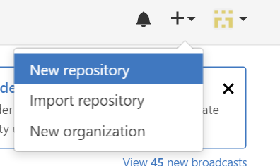
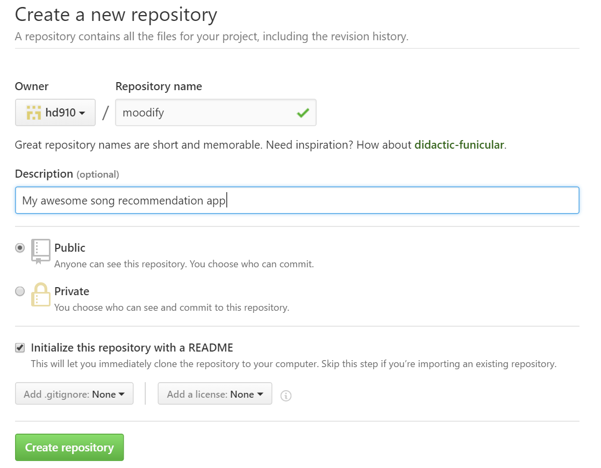
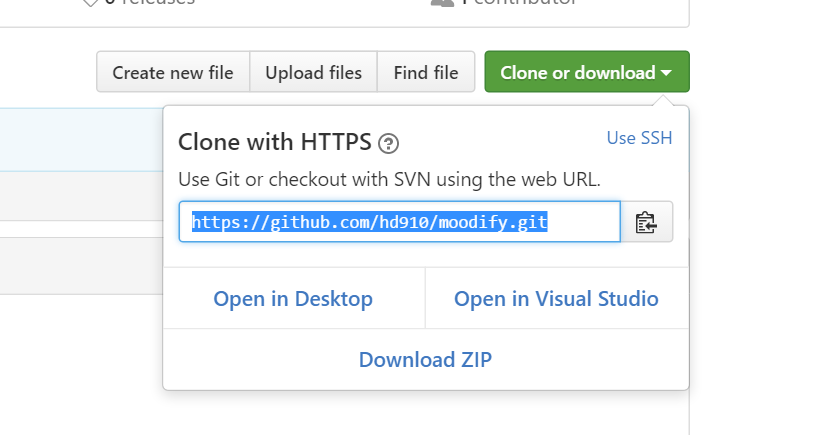
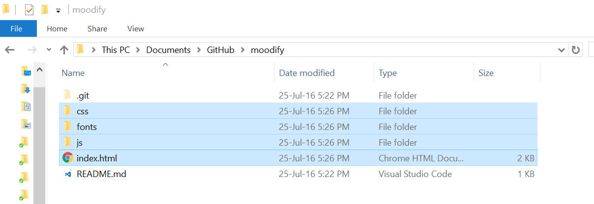
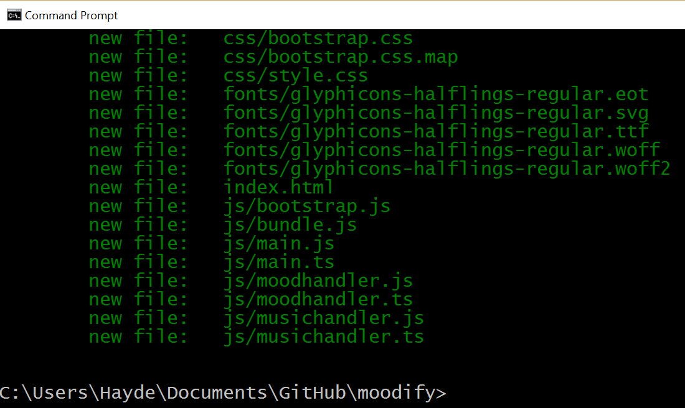

# 6. Source Control using GitHub
## Introduction
Source control using platforms like GitHub is a very important skill to have and you'll most likely use something like GitHub as a professional software developer. Git is the technology that powers GitHub and it is one of many different types of source control tools which helps manage codebases by recording changes to code over time. Without source control, it would be very difficult to work together in a team environment.

There are two interfaces when using git
* Graphic Interface
* Command Line Interface

I would recommend learning how to use command line even if you prefer the graphic interface - There's only a few commands you need to memorise and you'll most likely need to it when things go bad.

## Learning Outcomes
* Understand the benefit of using git
* Be able to make clones, commit changes and resolve conflicts using git
* Aware of what branches are and why they are important

## Step 1: Installation and Setup
### Installing Git
To install git, head over to this [link](https://git-scm.com/) and download the latest version of git

### Setting up a GitHub Account
Head over to [GitHub](https://github.com/) and create a new account if you don't have one already 

## Step 2: Create a Repository
Open up GitHub and create a 'New Repository' by clicking on the 'plus' icon on the top right corner of the screen

Give your repository a name and description. You choose to keep the repository public (others can see the source code) or private. 

You can also choose to initialise with a README if you want. 

When you are ready, press 'Create repository'

## Step 3: Clone Repository
On the main page of your GitHub repository, click 'Clone or download'

Copy the URL

Open up command prompt and navigate to a directory where you want to store your github files (e.g. C:\Users\Hayden\Documents\GitHub\)

Hint: See below on how to navigate using command line

When you are in the directory, type `clone https://github.com/YOUR_ID/YOUR_GITHUB_LINK` (the link you copied earlier)

## Step 4: Add Project Files
Open up your file explorer and navigate to the directory where you cloned your repository files (for me it is C:\Users\Hayden\Documents\GitHub\moodify)

Move your entire project files and folder here

Back to cmd, type `git status` and you will see that there are many files are 'untracked'  
(Hint: Make sure you are inside the project folder - cd moodify)

To add the files and folder, type `git add -A` which will add all the untracked files as shown in red.

Now if you type `git status`, you'll notice that all the files are now green 

Now its time to commit these changes. 

Type in `git commit -m "Add project files and folders"`

To upload these changes to GitHub, type `git push`

If you see something like this, you have successfully uploaded your files to GitHub!

## Basic Workflow
1. At the start of the day, `git pull` to get any changes other people have made while you were gone
2. Start coding away! 
Throughout the day, you will make several commits which include:
   1. `git status` to see changes
   2. `git add -A` to add all changes (dont have to add all)
   3. `git commit -m "Commit message"`
3. At the end of the day, `git pull` to get changes other people have made
4. If there are no conflicts (hopefully), `git push` to upload your commits to GitHub

If there are conflicts you'll need to sort it out manually and make another commit.

## Navigating Using Command Line

To open up command prompt, press **Win+R** and type **cmd**

**See All Files in the Current Directory** - `dir`

**Change Directory** - `cd [folder name]`

**Up One Folder** - `cd..`

## Git Basics
Here are the basic git commands. Make sure you are in the right directory or else it won't work.

**Clone** - `git clone`  
Clones the entire code base to the current location 

**Add** - `git add -A`  
Adds all changed code/files for commiting 

**Commit** - `git commit -m "Commit message"`  
This creates a commit with a message (If you use git commit without the commit message, you'll find yourself in VI text editor. To exit out, press `ESC` + `:` + `wq`  ) 

**Push** - `git push`  
Pushes the changes to the server

**Pull** - `git pull`  
Retrieves the changes from the server

**See All Branches** - `git branch`  
When you first create your repository, you'll only have one branch called Master

**Create a New Branch** - `git branch [branch name]`

**Change Branch** - `git checkout [branch name]`  
Switch from one branch to another

**Merge Branch**  - `git merge [name of branch]`  
Merge a branch with the currently selected branch. In an actual team, you may need to use a 'Pull Request' instead of a direct merge.

## Resources
### Bootcamp Content
* [Slide Deck](http://link.com)
* [Video](http://link.com)

### Tools
* [Visual Studio Code](https://code.visualstudio.com) - Code Editor with Git Build In 
* [Git](https://git-scm.com/)
* [GitHub](https://github.com)
* [GitHub Student Pack](https://education.github.com/pack) - Unlimited Private Repos on Github

### Extra Learning Resources
* [GitHub Online Training](https://try.github.io/)
* [GitHub Guide](https://guides.github.com/)
